Apliacion movil para solcitud de pedidos 
=========================================
Movil App para solictar productos a domicilio desde una pizzeria local
Esta aplicacion fue inicialmente escrita para Android usando los frameworks:
- [Ionic](http://ionicframework.com/)
- [AngularJS](https://angularjs.org/)

Usa una base de datos local en SQLite y se conecta a un web service, Esta aplicacion toma datos de una web App [DashboardYes](https://github.com/garibo/DashboardYes) que le provee precios, imagenes y permite realizar encargos.

Ademas implmenta las Api's para login de Empresas como [Google](https://console.developers.google.com) y [Facebook](https://developers.facebook.com/), de las cuales la aplicacion toma datos basicos personales como nombre y correo

Screen             |  Shots
:-------------------------:|:-------------------------:
  |  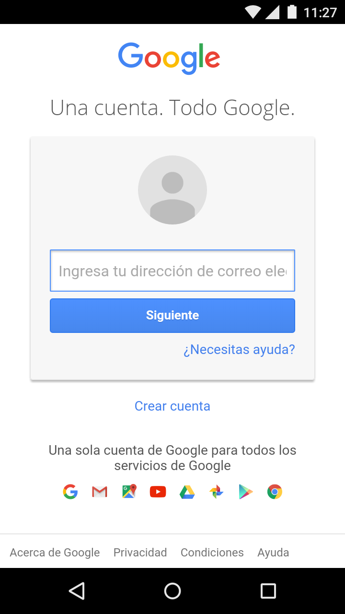
  |  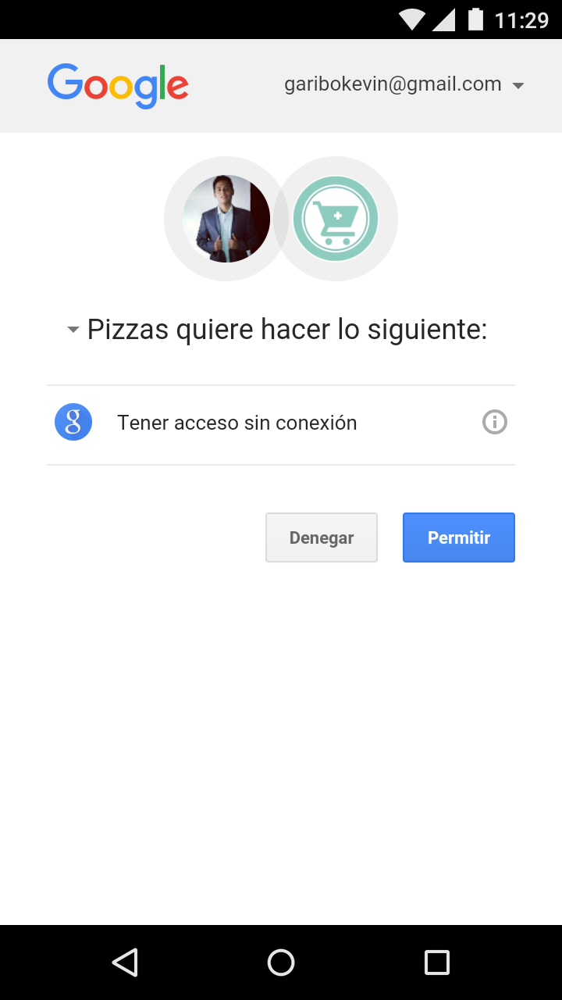
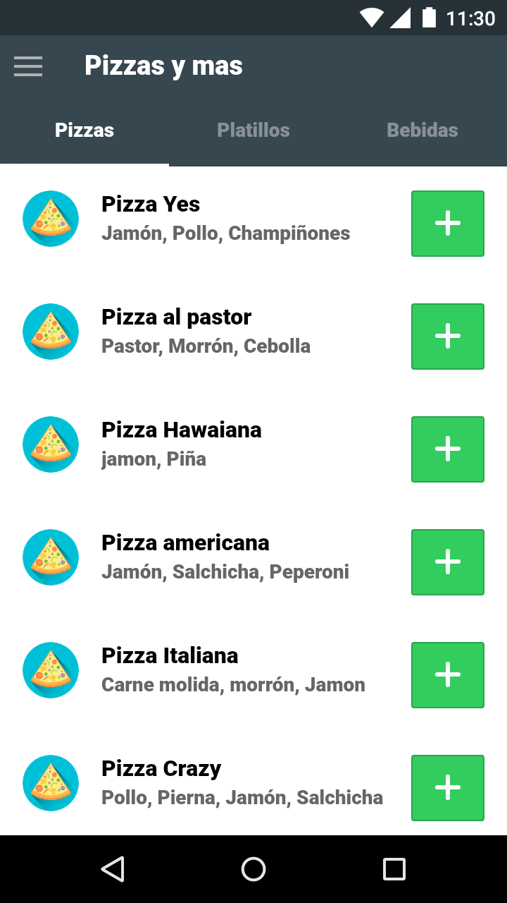  |  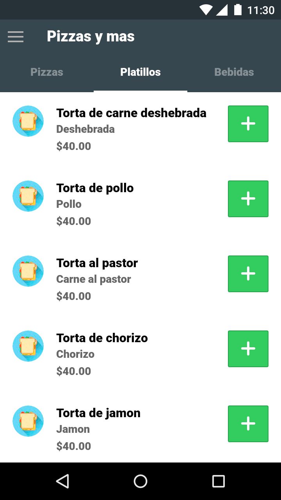
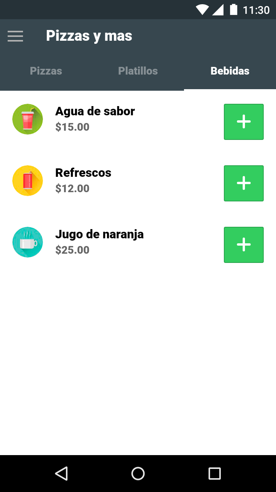  |  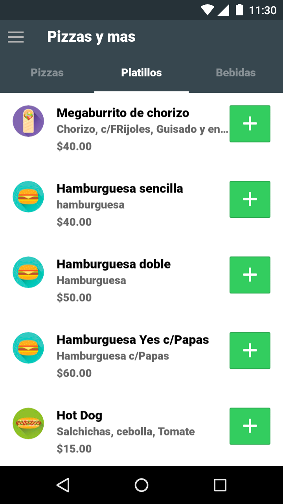
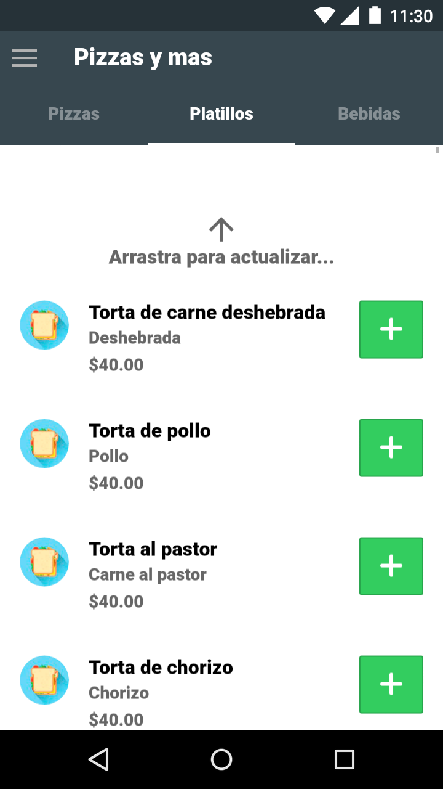  |  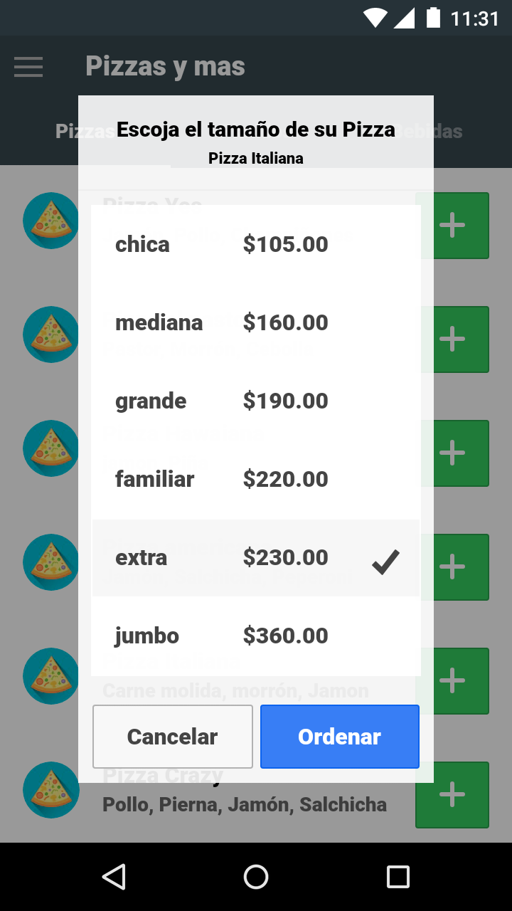
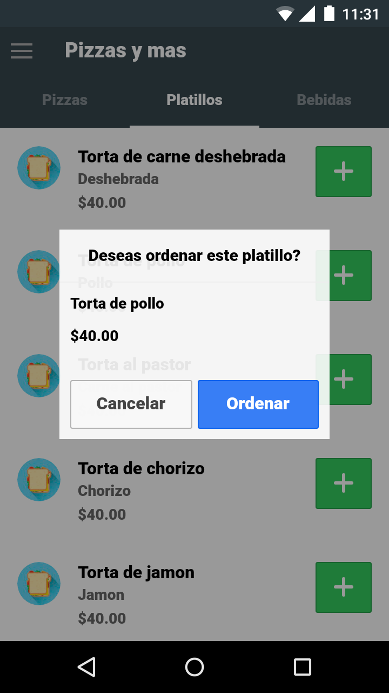  |  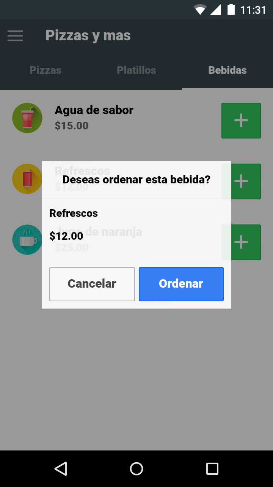
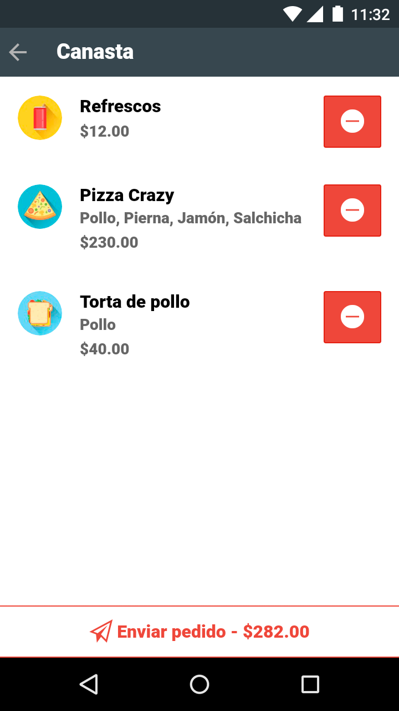  |  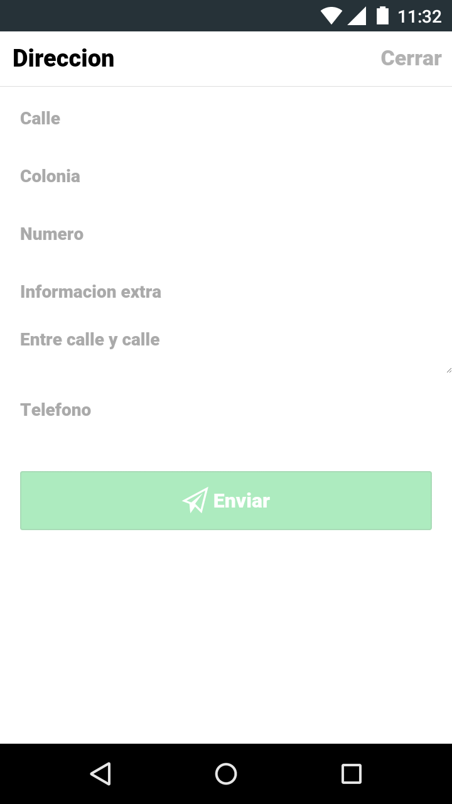
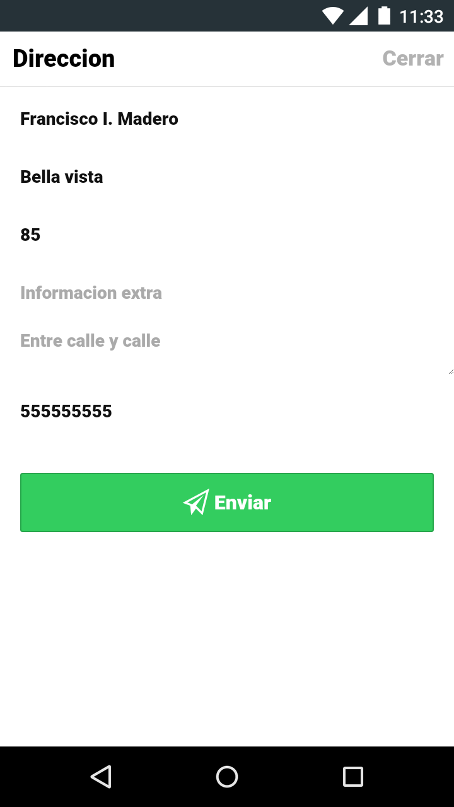  |  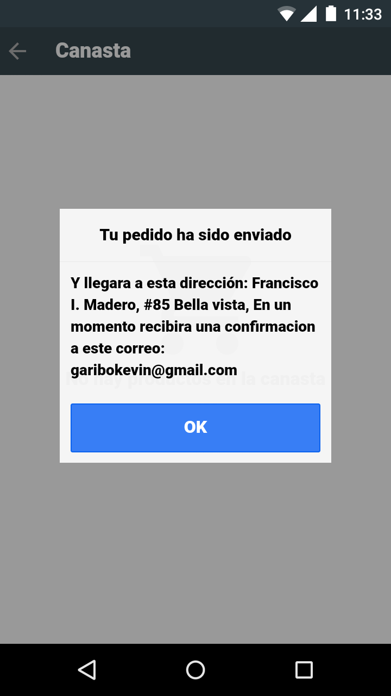
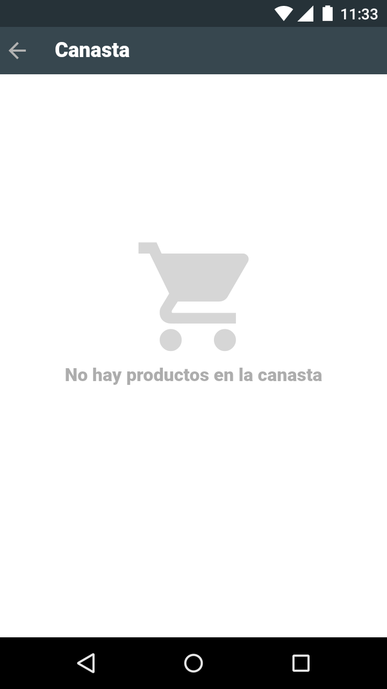  |  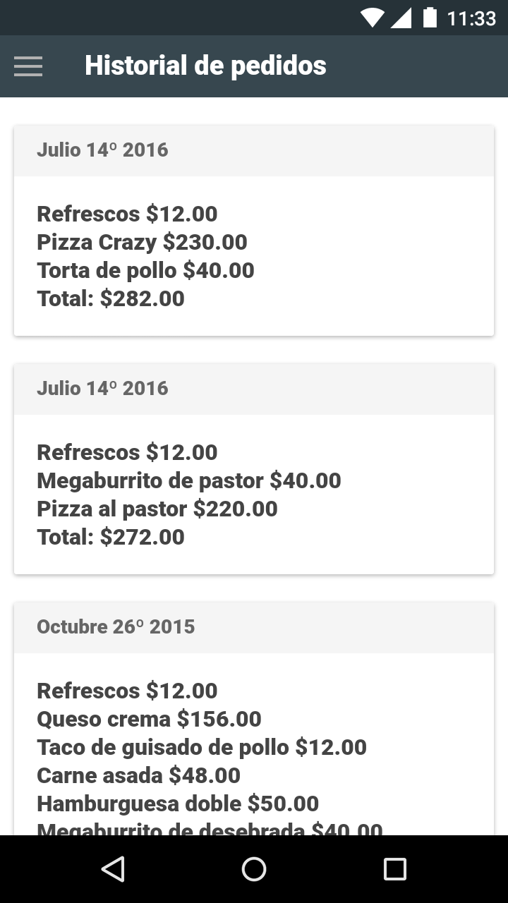
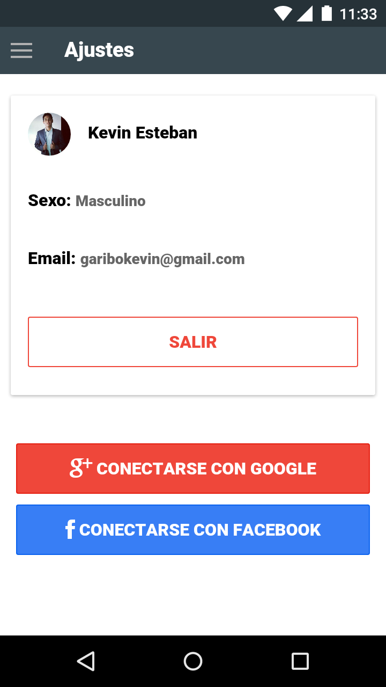  |  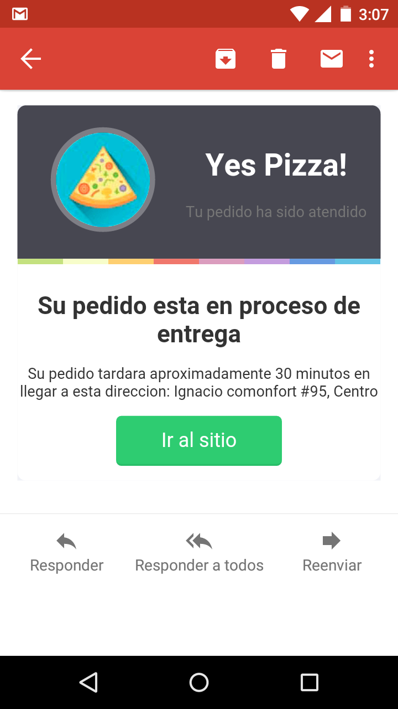
